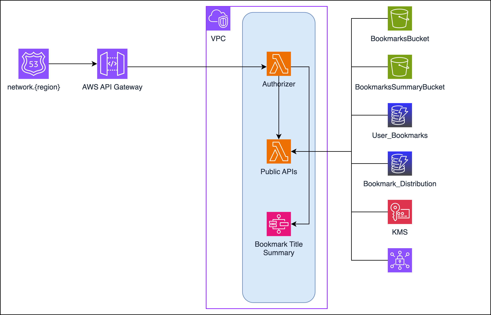

# Go Serverless API

Go Serverless API showcases Gin framework of Golang, setting up AWS lambda and execution using stepfunctions. The example APIs are to create/update/delete and search by bookmarks. Also the step function process uses the list of HTTP Bookmark URLs to gather all the webpages for each link and provide the corresponding content on the webpage.

## Setup

1. Install [Go v1.21.x](https://go.dev/dl/)

   Please check the Go version on your machine using `go version` command, as it should be version `gov1.21.x`. You can run multiple Go versions on the machine using [Go Version Manager (gvm)](https://github.com/moovweb/gvm). Below are commands to install `gvm` and setup Go v1.21 temperorily in order to run Go Serverless API.

       zsh < <(curl -s -S -L https://raw.githubusercontent.com/moovweb/gvm/master/binscripts/gvm-installer)

       gvm install go1.21
       gvm use go1.21

2. Install [Node.js](https://nodejs.org/) (v21.7.3 or above is recommended)

3. Install packages.

       go mod tidy
       npm install

Note: In order to execute the go command packages from command line, add `export PATH="$HOME/go/bin:$PATH"` to ~/.zshrc on Mac.

## Lint

The [GolangCi-Lint](https://golangci-lint.run/usage/linters/) provides various lint checks using Go tools such as [GoImports](https://pkg.go.dev/golang.org/x/tools/cmd/goimports) and [Vet](https://pkg.go.dev/cmd/vet), as well as other tools such as [StaticCheck](https://staticcheck.io/) and [ErrCheck](https://github.com/kisielk/errcheck). The lint make command is executed as below.

       make lint

## Test

Some unit tests require [gomock](https://github.com/golang/mock) mocks in order to execute.
These mocks are generated using using the[mockgen](https://github.com/golang/mock#running-mockgen) tool using [go generate comments](https://go.dev/blog/generate) within `mocks` directory in corresponding packages. Below is the command to generate mocks explicitly.

       make mocks

In case the above `make mocks` fails due to dependent modules then execute `go mod tidy` before. If go download modules fails due to mocks then clean the go runtime modules using below command.

       go clean -modcache

To execute all the unit tests (which also generates mocks) use the below make command.

       make test

To check the code coverage use the below go command.

       go tool cover -html=coverage.out

## Build

The make `clean` command cleans all the binaries, temp files and mocks generated. The make `build` command execute all the tests and creates binary executables for all the applications within the `bin` directory.

       make clean build

## Run Locally

Go Serverless API can be executed locally by setting up [LocalStack](https://docs.localstack.cloud/getting-started/installation/) using below make commands. Once running the public API application use `http://localhost:8080/api/go/bookmarks/` to access the HTTP services.

**NOTE**: Please ensure that [docker](https://docs.docker.com/engine/install/) instance is running before executing below commands.

       make localstack-start
       make runapi

To stop and destroy the localstack docker instance execute below coomands.

       make localstack-stop
       make localstack-destroy

## Integration Test

Integration test allows to execute [Ginkgo](https://onsi.github.io/ginkgo/) tests on public APIs using Behavior Driven Development format. The localstack environment and the local Public API allows to test the Go Serverless APIs. Internally it starts localstack, creates infrastructure in localstack, starts public API gin instance and executes [Ginkgo](https://onsi.github.io/ginkgo/) tests on public APIs. It requires [docker](https://docs.docker.com/engine/install/) instance be running before execution of the below command. 

       make run-int-test

## Infrastructure Setup

Need to have a AWS account to deploy Serverless lambda application in cloud.

1. Install or update the [AWS CLI](https://docs.aws.amazon.com/cli/latest/userguide/getting-started-install.html)

2. Run the below configure command to create login profile. To create `default` profile remove the `--profile` option. Enter the AWS Access Key ID, Secret Access Key, default region, and default output format for the profile when prompted to setup new AWS profile. 
The AWS CLI will create a profile configuration in the `~/.aws/config` file along with `~/.aws/credentials` with login credentials.

        $ aws configure --profile <profile_name>

3. Install [Terraform v1.5.7](https://developer.hashicorp.com/terraform/install) using the steps from [tutorial](https://developer.hashicorp.com/terraform/tutorials/aws-get-started/install-cli).

4. Install [Terragrunt v0.54.17](https://terragrunt.gruntwork.io/docs/getting-started/install/)

5. Execute the below terragrunt commands to deploy the application resources.

        $ terragrunt init
        $ terragrunt plan
        $ terragrunt apply -auto-approve -input=false

## Deploy Serverless Application

Go Serverless API deployment in an AWS environment requires a stack name be provided and the AWS deployment region. Use below SLS command for deployment.

    npx sls deploy --stage <STACK_NAME> --region <REGION> --verbose

The Go Serverless APIs can also be accessed using the internal API Gateway URLs which are displayed in the console after the SLS deployment as endpoint. Use below API Gateway URLs.

      https://[API_GATEWAY_ID].execute-api.[REGION].amazonaws.com/[STACK_NAME]/emprovise/api/bookmarks/

To remove the serverless stack from AWS environment use below command:

    npx sls remove --stage <STACK_NAME> --region <REGION> --verbose

